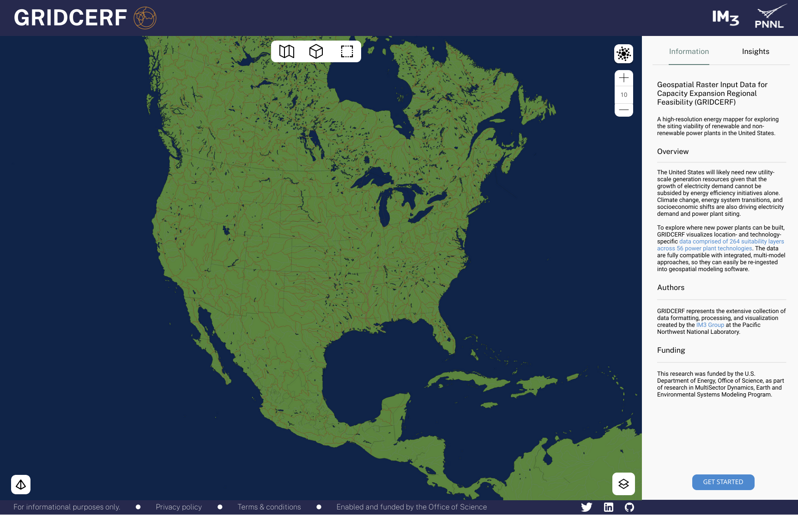
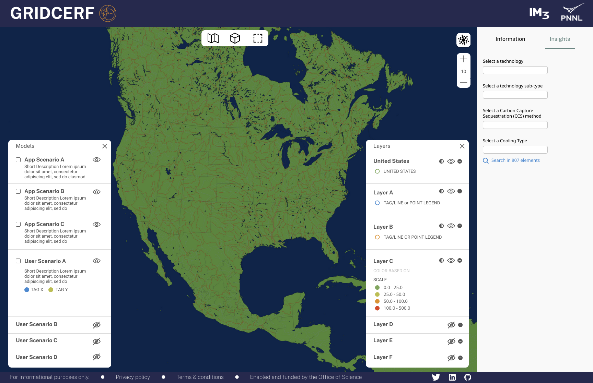
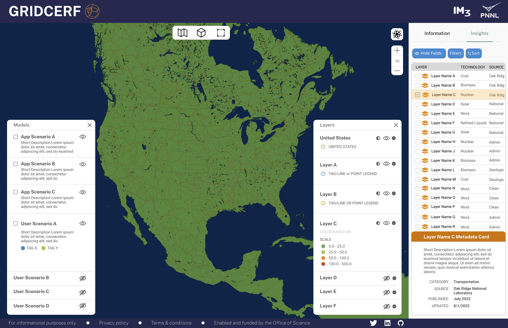

> :warning: **This project is in development.** Some features may not be available yet or may be subject to change.

# GRIDCERF 

Geospatial Raster Input Data for Capacity Expansion Regional Feasibility (GRIDCERF) is a high-resolution energy mapper for exploring the siting viability of renewable and non-renewable power plants in the United States. It is hosted by MSD-LIVE.


## Table of Contents

1. [Overview](#overview)
2. [Authors](#authors)
3. [Publications](#publications)
4. [Funding](#funding)
5. [Python Requirements](#requirements)
6. [Run Locally](#local)
7. [Deployment](#deploying)

<br>



<br>



<br>



<br>

## Overview <a name="overview"></a>

The United States will likely need new utility-scale generation resources given that the growth of electricity demand cannot be subsided by energy efficiency initiatives alone. Climate change, energy system transitions, and socioeconomic shifts are also driving electricity demand and power plant siting. 

To explore where new power plants can be built, GRIDCERF visualizes location- and technology-specific data comprised of 264 suitability layers across 56 power plant technologies. The data are fully compatible with integrated, multi-model approaches, so they can easily be re-ingested into geospatial modeling software.

## Authors <a name="authors"></a>

GRIDCERF represents the extensive collection of data formatting, processing, and visualization created by the IM3 Group at the Pacific Northwest National Laboratory.


## Publications <a name="publications"></a>

Vernon, C. R., Mongird, K., Nelson, K., & Rice, J. S. (2023). GRIDCERF: Geospatial Raster Input Data for Capacity Expansion Regional Feasibility (v1.1.3) [Data set]. Zenodo. https://doi.org/10.5281/zenodo.8218921

## Funding <a name="funding"></a>

This research was funded by the U.S. Department of Energy, Office of Science, as part of research in MultiSector Dynamics, Earth and Environmental Systems Modeling Program.


## Python Requirements <a name="requirements"></a>

GRIDCERF runs on **Python version 3.12**, so you will need to create a Python virtual environment that runs Python 3.12.

  

Also, GRIDCERF most importantly requires **Dash version >=2.9.2**. Dash >=2.9.2 supports [advanced callbacks](https://dash.plotly.com/duplicate-callback-outputs) but it only works in Python 3.12 and above. 

The `requirements.txt` in `dash_app` lists Python packages and their versions needed to run GRIDCERF following Python installation. We suggest your environment reflects these package versions.

  
  
  
  
  
  
  
  
  
  
  
  
  

## Run GRIDCERF Locally <a name="local"></a>

Git clone this repository. In terminal (MacOS) or command prompt (Windows), navigate inside the `dash_app` folder and run the application by typing and executing the following:

```
$ python app.py
```

A URL with an IP address including `127.0.0.1` should appear that can be copied and pasted in a browser. `127.0.0.1` is the localhost of your local machine, and the `8060` is the port that is specified in the application:

```
Dash is running on http://127.0.0.1:8060/

 * Serving Flask app 'app'
 * Debug mode: on
```

After launching the application, you should see and be able to interact with GRIDCERF in the browser. This is only visible to you on your local machine for as long as you are running the script.

 

## Deploying GRIDCERF <a name="deploying"></a>

### Apache Web Server

A Dash app is a web framework, but without a web server, Dash apps can only run on localhost where only you can access them on your own machine ([see Running GRIDCERF Locally](#local)). To deploy and share GRIDCERF with a public IP or domain name, it needs a virtual web server, like Apache. **Apache** is an open-source HTTP server for modern operating systems, and it can communicate over networks from client to server using the TCP/IP protocol. The TCP/IP protocol specifies how devices exchange data over the internet to one another via channels of communication (TPC) and routes and addresses (IP). Apache can be used for a various protocols, but the most common is HTTP/S.

Apache version 2.4.56 is recommended.

  

### WSGI for Forwarding Requests

Apache can communicate over networks but it also needs to communicate with the Python application. **Web Server Gateway Interface (WSGI)** allows web servers to forward requests to web apps or frameworks written in Python. Make sure Apache has `mod_wsgi` installed; if you are installing the Apache module by hand, the file is called 'mod_wsgi.so'. To ensure a successful installation, follow the official [mod_wsgi documentation](https://modwsgi.readthedocs.io/en/develop/index.html) to ensure proper installation. For example, please note this important Python and WSGI installation procedure:

*"Note that the Python virtual environment must have been created using the same base Python version as was used to compile the mod_wsgi module. You can’t use this to force mod_wsgi to somehow use a different Python version than it was compiled for. If you want to use a different version of Python, you will need to reinstall mod_wsgi, compiling it for the version you want. It is not possible for the one mod_wsgi instance to run applications for both Python 2 and 3 at the same time."* ([WSGIDaemonProcess](https://modwsgi.readthedocs.io/en/develop/configuration-directives/WSGIDaemonProcess.html))

### Apache Config File

The **Apache configuration file** then needs to be scripted and the installed WSGI module loaded in the config file so that the WSGI can mediate all communication between the web server and GRIDCERF.

The Apache config file, `gridcerf.ssl.conf`, shows how the Apache config file needs to be set up in order to load and use WSGI, with the most important setup as follows: 

```
LoadModule wsgi_module modules/mod_wsgi.so

<VirtualHost *:8050>

    DocumentRoot    /www/GRIDCERF/dash_app
    Timeout 600

    WSGIDaemonProcess Dash threads=1 processes=2 request-timeout=600 socket-timeout=600
    WSGIScriptAlias / /www/GRIDCERF/dash_app/wsgi.py process-group=Dash application-group=%{GLOBAL}

    <Directory /www/GRIDCERF/dash_app>
        Require all granted
    </Directory>

    <Directory /www/GRIDCERF/data>
        Require all granted
    </Directory>

</VirtualHost>
```

If you host multiple Python virtual environments, it might also be best practice to define the `python-home` argument (i.e., the location of the Python virtual environment) in `WSGIDaemonProcess`.

*Note: "If using a Python virtual environment, rather than use [`python-path`] to refer to the site-packages directory of the Python virtual environment, you should use the python-home option to specify the root of the Python virtual environment instead."* ([WSGIDaemonProcess](https://modwsgi.readthedocs.io/en/develop/configuration-directives/WSGIDaemonProcess.html))

```
WSGIDaemonProcess python-home=/var/www/<venv>/lib/python3.12/site-packages
```


### Apache and File Permissions

Permissions will be different across systems, but ensure that the GRIDCERF directory that hosts the application is readable by Apache. For example, by running the following:

```
chown -Rh apache dash_app
```

In `/usr/local/lib`, which hosts libraries installed (compiled) by yourself, ensure that the Python packages you installed have enough permissions to be read and executed:

```
find /usr/local/lib* -type d -exec chmod 755 {} \;
find /usr/local/lib* -type f -exec chmod o+r {} \;
```


### Python Paths for File Requests

The `wsgi.py` script also mediates communication between Apache and the Python web application. In `wsgi.py`, update the path to the Python virtual environment and to the app directory, for example:

```
site.addsitedir('/var/www/<venv>/lib/python3.12/site-packages') 
sys.path.insert(0, "/var/www/<path>/dash_app")
```

Finally, for errors regarding file requests, especially due to arguments like `url_base_pathname` or `requests_pathname_prefix` when initiating the Dash application in `app.py`, please refer to the `dash.Dash()` documentation is located online on the [Dash API Reference page](https://dash.plotly.com/reference).
